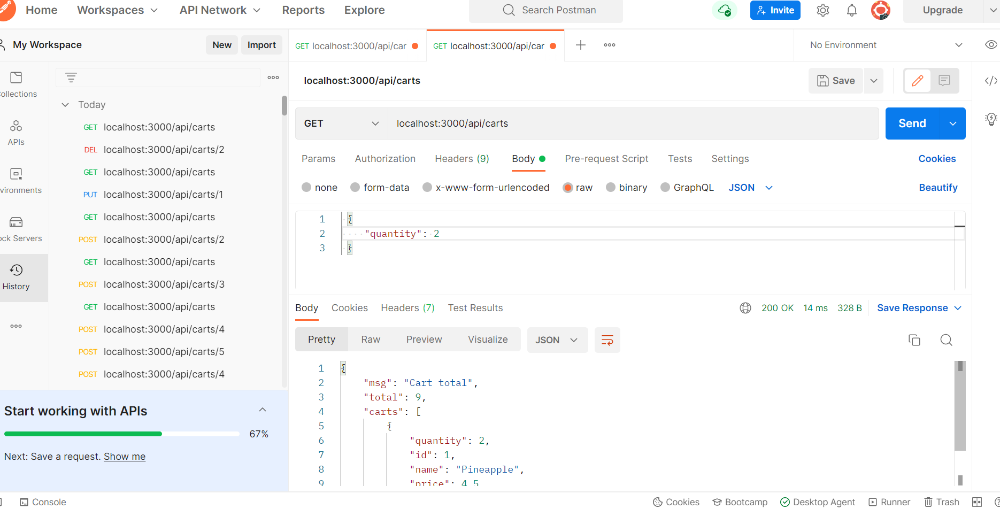

# node-cart-mocha-chai
Node.js and express shopping cart using POSTMAN with a mocha/chai test

This application uses basic node.js and express to create a shopping cart with no HTML or CSS. Postman is used to check the API routes. The code is run from this folder's terminal with "node index.js". The main app for the carts is found at  [Cart.js](.\node_shopper\Carts.js). The products list had CRUD operations found at  [Products.js](.\node_shopper\Products.js)
A short mocha test is run on the welcome message. [Test folder](.\node_shopper\test\cartsTest.js)

